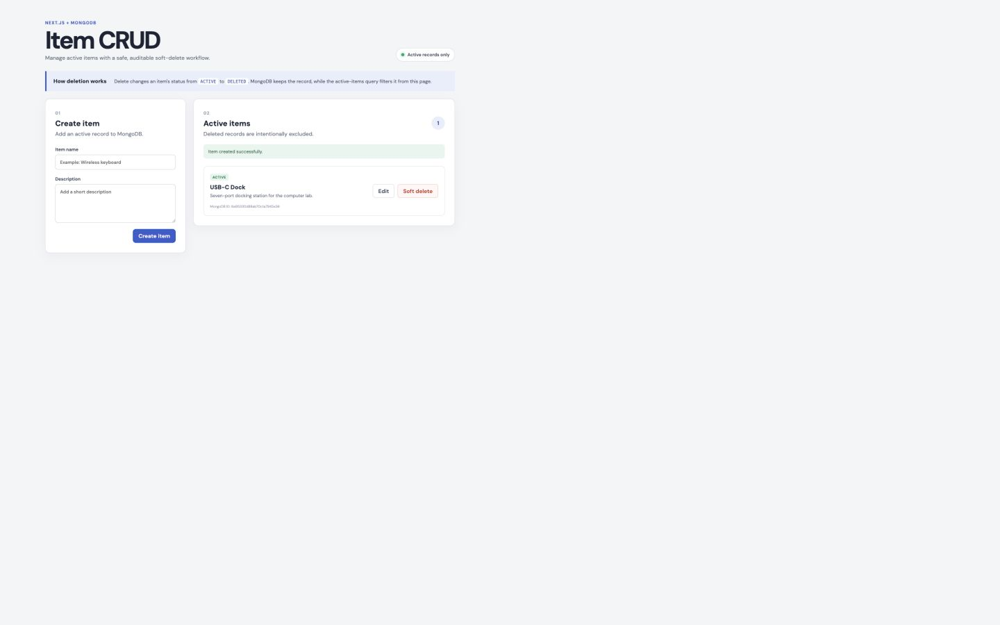
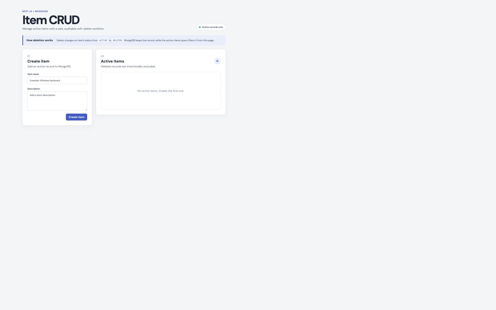

# Item CRUD — MongoDB Soft Delete

This assignment contains a Next.js backend and React frontend that demonstrate soft deletion. Deleting an item does not remove its MongoDB document. The API changes its `status` from `ACTIVE` to `DELETED`, adds a `deletedAt` timestamp, and filters deleted records from the normal item list.

## Project structure

```text
item-crud-soft-delete/
├── app/                 Next.js backend and API routes
├── lib/                 Shared MongoDB connection
├── frontend/            React and Vite user interface
└── evidence/            Screenshots of the deletion workflow
```

## Soft-delete process

1. New items are created with `status: "ACTIVE"`.
2. The frontend sends `DELETE /api/items/:id`.
3. The backend uses MongoDB `updateOne` rather than `deleteOne`.
4. The document is updated to `status: "DELETED"` with `deletedAt` and `updatedAt` timestamps.
5. `GET /api/items` uses `{ status: { $ne: "DELETED" } }`, so deleted records do not appear in the active list.
6. The document remains available in MongoDB for audit or recovery.

## API endpoints

| Method | Endpoint | Purpose |
| --- | --- | --- |
| `GET` | `/api/items` | Return active items only |
| `POST` | `/api/items` | Create an active item |
| `PUT` | `/api/items/:id` | Update an active item |
| `DELETE` | `/api/items/:id` | Mark an item as deleted |

## Run locally

Create `.env.local` in the repository root using `.env.example` as the template. Keep the real MongoDB connection string private.

For a self-contained local demonstration, start the development MongoDB process first:

```bash
npm run db:memory
```

For MongoDB Atlas, replace the local URI in `.env.local` with your private Atlas connection string instead.

### Backend

```bash
npm install
npm run dev
```

The Next.js backend runs at `http://localhost:3000`.

### Frontend

In a second terminal:

```bash
cd frontend
npm install
npm run dev
```

The React frontend runs at `http://localhost:5173` and proxies `/api` requests to the backend.

## Evidence

### 1. Active item before deletion



### 2. Item filtered after deletion



The verified DELETE response was:

```json
{
  "success": true,
  "message": "Item soft deleted",
  "status": "DELETED"
}
```

A direct MongoDB query then confirmed that the same document still existed with `status: "DELETED"`, a populated `deletedAt` value, and `recordStillExists: true`. The normal active-item endpoint returned an empty list because its query excludes deleted records.

## Security

- `.env.local` is ignored and never committed.
- The public repository contains `.env.example` with a safe placeholder only.
- MongoDB credentials are not included in source code or screenshots.
